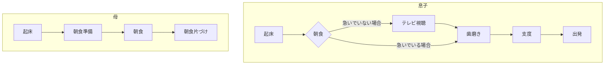
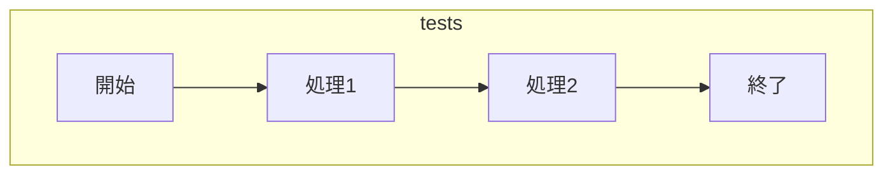

```mermaid
flowchart TD

subgraph 息子
a1[起床]-->a2{朝食}
a2-->|急いでいない場合|a3[テレビ視聴]-->a4[歯磨き]
a2-->|急いでいる場合|a4
a4-->a5[支度]-->a6[出発]
end

subgraph 母
b1[起床]-->b2[朝食準備]-->b3[朝食]-->b4[朝食片づけ]
end
```

```mermaid
graph TD

subgraph tests
a1[開始]-->a2[処理1]-->a3[処理2]-->a4[終了]
end
```