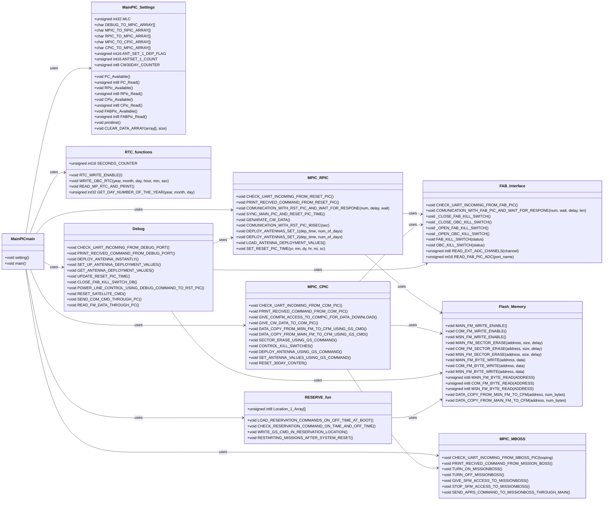

```mermaid
classDiagram
    direction LR

    class MainPICmain {
        +void setting()
        +void main()
    }
    %%note for MainPICmain "MainPICmain.c\nMainPICのメインループと初期設定。各モジュールを統括する。"

    class MainPIC_Settings {
        +unsigned int32 MLC
        +char DEBUG_TO_MPIC_ARRAY[]
        +char MPIC_TO_RPIC_ARRAY[]
        +char RPIC_TO_MPIC_ARRAY[]
        +char MPIC_TO_CPIC_ARRAY[]
        +char CPIC_TO_MPIC_ARRAY[]
        +unsigned int16 ANT_SET_1_DEP_FLAG
        +unsigned int16 ANTSET_1_COUNT
        +unsigned int8 CW30DAY_COUNTER
        +void PC_Available()
        +unsigned int8 PC_Read()
        +void RPic_Available()
        +unsigned int8 RPic_Read()
        +void CPic_Available()
        +unsigned int8 CPic_Read()
        +void FABPic_Available()
        +unsigned int8 FABPic_Read()
        +void printline()
        +void CLEAR_DATA_ARRAY(array[], size)
    }
    %%note for MainPIC_Settings "MainPIC_Settings.c\nMainPIC側のグローバル変数、バッファ、UARTのISRとドライバ関数を定義。"

    class RTC_functions {
        +unsigned int16 SECONDS_COUNTER
        +void RTC_WRITE_ENABLE(i)
        +void WRITE_OBC_RTC(year, month, day, hour, min, sec)
        +void READ_MP_RTC_AND_PRINT()
        +unsigned int32 GET_DAY_NUMBER_OF_THE_YEAR(year, month, day)
    }
    %%note for RTC_functions "RTC_functions.c\nMainPICの内部リアルタイムクロック(RTC)の読み書きを管理。"

    class MPIC_RPIC {
        +void CHECK_UART_INCOMING_FROM_RESET_PIC()
        +void PRINT_RECIVED_COMMAND_FROM_RESET_PIC()
        +void COMUNICATION_WITH_RST_PIC_AND_WAIT_FOR_RESPONE(num, delay, wait)
        +void SYNC_MAIN_PIC_AND_RESET_PIC_TIME()
        +void GENARATE_CW_DATA()
        +void COMUNICATION_WITH_RST_PIC_90SEC(sec)
        +void DEPLOY_ANTENNAS_SET_1(dep_time, num_of_days)
        +void DEPLOY_ANTENNAS_SET_2(dep_time, num_of_days)
        +void LOAD_ANTENNA_DEPLOYMENT_VALUES()
        +void SET_RESET_PIC_TIME(yr, mn, dy, hr, mi, sc)
    }
    %%note for MPIC_RPIC "MPIC_RPIC.c\nMainPICからResetPICへの通信、時刻同期、アンテナ展開、CWデータ生成などを担当。"

    class MPIC_CPIC {
        +void CHECK_UART_INCOMING_FROM_COM_PIC()
        +void PRINT_RECIVED_COMMAND_FROM_COM_PIC()
        +void GIVE_COMFM_ACCESS_TO_COMPIC_FOR_DATA_DOWNLOAD()
        +void GIVE_CW_DATA_TO_COM_PIC()
        +void DATA_COPY_FROM_MSN_FM_TO_CFM_USING_GS_CMD()
        +void DATA_COPY_FROM_MAIN_FM_TO_CFM_USING_GS_CMD()
        +void SECTOR_ERASE_USING_GS_COMMAND()
        +void CONTROL_KILL_SWITCHES()
        +void DEPLOY_ANTENNA_USING_GS_COMMAND()
        +void SET_ANTENNA_VALUES_USING_GS_COMMAND()
        +void RESET_30DAY_CONTER()
    }
    %%note for MPIC_CPIC "MPIC_CPIC.c\nMainPICからComPicへの通信と、ComPicから転送されたGSコマンドの実行を担当。"

    class FAB_Interface {
        +void CHECK_UART_INCOMING_FROM_FAB_PIC()
        +void COMUNICATION_WITH_FAB_PIC_AND_WAIT_FOR_RESPONE(num, wait, delay, len)
        +void _CLOSE_FAB_KILL_SWITCH()
        +void _CLOSE_OBC_KILL_SWITCH()
        +void _OPEN_FAB_KILL_SWITCH()
        +void _OPEN_OBC_KILL_SWITCH()
        +void FAB_KILL_SWITCH(status)
        +void OBC_KILL_SWITCH(status)
        +unsigned int8 READ_EXT_ADC_CHANELS(channel)
        +unsigned int16 READ_FAB_PIC_ADC(port_name)
    }
    %%note for FAB_Interface "MPIC_FAB.c, FAB_Settings.c, Definitions.c\nFAB PICとの通信、キルスイッチのハードウェア操作、ADC読取などのインターフェースを統合。"

    class MPIC_MBOSS {
        +void CHECK_UART_INCOMING_FROM_MBOSS_PIC(looping)
        +void PRINT_RECIVED_COMMAND_FROM_MISSION_BOSS()
        +void TURN_ON_MISSIONBOSS()
        +void TURN_OFF_MISSIONBOSS()
        +void GIVE_SFM_ACCESS_TO_MISSIONBOSS()
        +void STOP_SFM_ACCESS_TO_MISSIONBOSS()
        +void SEND_APRS_COMMAND_TO_MISSIONBOSS_THROUGH_MAIN()
    }
    %%note for MPIC_MBOSS "MPIC_MBOSS.c\nMainPICからMission Bossへの通信、電源制御、APRSコマンド転送を担当。"

    class Flash_Memory {
        +void MAIN_FM_WRITE_ENABLE()
        +void COM_FM_WRITE_ENABLE()
        +void MSN_FM_WRITE_ENABLE()
        +void MAIN_FM_SECTOR_ERASE(address, size, delay)
        +void COM_FM_SECTOR_ERASE(address, size, delay)
        +void MSN_FM_SECTOR_ERASE(address, size, delay)
        +void MAIN_FM_BYTE_WRITE(address, data)
        +void COM_FM_BYTE_WRITE(address, data)
        +void MSN_FM_BYTE_WRITE(address, data)
        +unsigned int8 MAIN_FM_BYTE_READ(ADDRESS)
        +unsigned int8 COM_FM_BYTE_READ(ADDRESS)
        +unsigned int8 MSN_FM_BYTE_READ(ADDRESS)
        +void DATA_COPY_FROM_MSN_FM_TO_CFM(address, num_bytes)
        +void DATA_COPY_FROM_MAIN_FM_TO_CFM(address, num_bytes)
    }
    %%note for Flash_Memory "Flash_Memory.c\n3つのFlashメモリ（Main, Com, Mission）に対する低レベルなSPI操作を抽象化。"

    class RESERVE_fun {
        +unsigned int8 Location_1_Array[]
        +void LOAD_RESERVATION_COMMANDS_ON_OFF_TIME_AT_BOOT()
        +void CHECK_RESERVATION_COMMAND_ON_TIME_AND_OFF_TIME()
        +void WRITE_GS_CMD_IN_RESERVATION_LOCATION()
        +void RESTARTING_MISSIONS_AFTER_SYSTEM_RESET()
    }
    %%note for RESERVE_fun "RESERVE_fun.c\nコマンドの予約実行機能。Flashメモリへの予約情報の保存、読み出し、時刻監視を行う。"
    
    class Debug {
        +void CHECK_UART_INCOMING_FROM_DEBUG_PORT()
        +void PRINT_RECIVED_COMMAND_FROM_DEBUG_PORT()
        +void DEPLOY_ANTENNA_INSTANTLY()
        +void SET_UP_ANTENNA_DEPLOYMENT_VALUES()
        +void GET_ANTENNA_DEPLOYMENT_VALUES()
        +void UPDATE_RESET_PIC_TIME()
        +void CLOSE_FAB_KILL_SWITCH_DB()
        +void POWER_LINE_CONTROL_USING_DEBUG_COMMAND_TO_RST_PIC()
        +void RESET_SATELLITE_CMD()
        +void SEND_COM_CMD_THROUGH_PC()
        +void READ_FM_DATA_THROUGH_PC()
    }
    %%note for Debug "Debug.c\nデバッグポート経由での各種コマンド実行機能を提供。"

    %%' --- Relationships ---
    MainPICmain --> MainPIC_Settings : uses
    MainPICmain --> RTC_functions : uses
    MainPICmain --> MPIC_RPIC : uses
    MainPICmain --> MPIC_CPIC : uses
    MainPICmain --> MPIC_MBOSS : uses
    MainPICmain --> Debug : uses
    MainPICmain --> RESERVE_fun : uses

    MPIC_RPIC --> FAB_Interface : uses
    MPIC_RPIC --> Flash_Memory : uses

    MPIC_CPIC --> FAB_Interface : uses
    MPIC_CPIC --> MPIC_MBOSS : uses
    MPIC_CPIC --> Flash_Memory : uses

    Debug --> FAB_Interface : uses
    Debug --> MPIC_RPIC : uses
    Debug --> Flash_Memory : uses

    RESERVE_fun --> Flash_Memory : uses
```