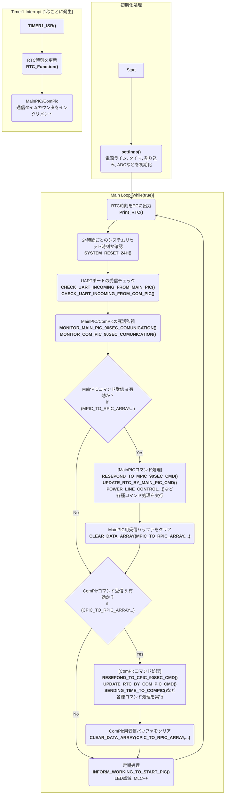

```mermaid
graph TD
    subgraph Initialization [初期化処理]
        A[Start] --> B("<b>settings()</b><br>電源ライン, タイマ, 割り込み, ADCなどを初期化");
    end

    subgraph "Main Loop [while(true)]"
        direction TB
        B --> C("RTC時刻をPCに出力<br><b>Print_RTC()</b>");
        C --> D("24時間ごとのシステムリセット時刻か確認<br><b>SYSTEM_RESET_24H()</b>");
        D --> E("UARTポートの受信チェック<br><b>CHECK_UART_INCOMING_FROM_MAIN_PIC()</b><br><b>CHECK_UART_INCOMING_FROM_COM_PIC()</b>");
        E --> F("MainPIC/ComPicの死活監視<br><b>MONITOR_MAIN_PIC_90SEC_COMUNICATION()</b><br><b>MONITOR_COM_PIC_90SEC_COMUNICATION()</b>");

        F --> G{"MainPICコマンド受信 & 有効か？<br>if (MPIC_TO_RPIC_ARRAY...)"};
        
        G -- Yes --> H["[MainPICコマンド処理]<br><b>RESEPOND_TO_MPIC_90SEC_CMD()</b><br><b>UPDATE_RTC_BY_MAIN_PIC_CMD()</b><br><b>POWER_LINE_CONTROL...()</b>など<br>各種コマンド処理を実行"];
        H --> I("MainPIC用受信バッファをクリア<br><b>CLEAR_DATA_ARRAY(MPIC_TO_RPIC_ARRAY,...)</b>");
        
        G -- No --> J;
        I --> J{"ComPicコマンド受信 & 有効か？<br>if (CPIC_TO_RPIC_ARRAY...)"};

        J -- Yes --> K["[ComPicコマンド処理]<br><b>RESEPOND_TO_CPIC_90SEC_CMD()</b><br><b>UPDATE_RTC_BY_COM_PIC_CMD()</b><br><b>SENDING_TIME_TO_COMPIC()</b>など<br>各種コマンド処理を実行"];
        K --> L("ComPic用受信バッファをクリア<br><b>CLEAR_DATA_ARRAY(CPIC_TO_RPIC_ARRAY,...)</b>");

        J -- No --> M;
        L --> M("定期処理<br><b>INFORM_WORKING_TO_START_PIC()</b><br>LED点滅, MLC++");
        
        M --> C;
    end

    subgraph "Timer1 Interrupt [1秒ごとに発生]"
        direction TB
        Z["<b>TIMER1_ISR()</b>"] --> Z1("RTC時刻を更新<br><b>RTC_Function()</b>");
        Z1 --> Z2("MainPIC/ComPic<br>通信タイムカウンタをインクリメント");
    end
```