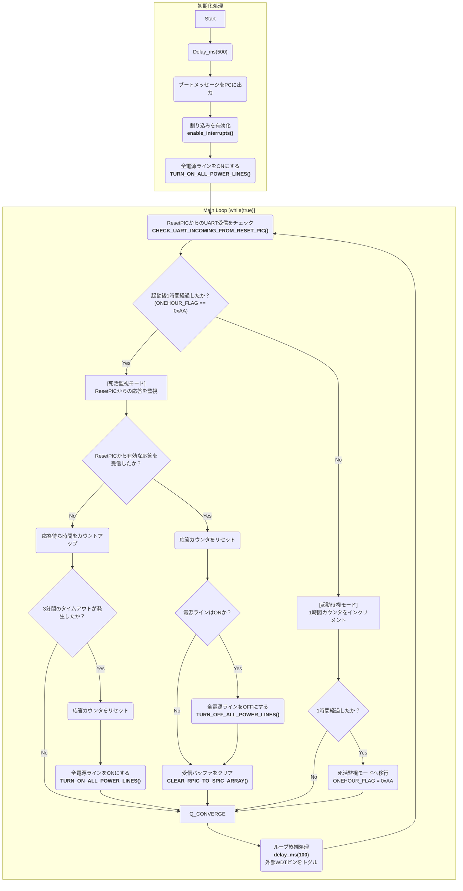

```mermaid
graph TD
    subgraph Initialization [初期化処理]
        A[Start] --> B("Delay_ms(500)");
        B --> C("ブートメッセージをPCに出力");
        C --> D("割り込みを有効化<br><b>enable_interrupts()</b>");
        D --> E("全電源ラインをONにする<br><b>TURN_ON_ALL_POWER_LINES()</b>");
    end

    subgraph "Main Loop [while(true)]"
        direction TB
        E --> F_LOOP_START("ResetPICからのUART受信をチェック<br><b>CHECK_UART_INCOMING_FROM_RESET_PIC()</b>");
        
        F_LOOP_START --> G{"起動後1時間経過したか？<br>(ONEHOUR_FLAG == 0xAA)"};

        G -- Yes --> H["[死活監視モード]<br>ResetPICからの応答を監視"];
        H --> I{"ResetPICから有効な応答を受信したか？"};
        I -- Yes --> J("応答カウンタをリセット");
        J --> K{"電源ラインはONか？"};
        K -- Yes --> L("全電源ラインをOFFにする<br><b>TURN_OFF_ALL_POWER_LINES()</b>");
        K -- No --> M;
        L --> M("受信バッファをクリア<br><b>CLEAR_RPIC_TO_SPIC_ARRAY()</b>");

        I -- No --> N("応答待ち時間をカウントアップ");
        N --> O{"3分間のタイムアウトが発生したか？"};
        O -- Yes --> P("応答カウンタをリセット");
        P --> Q("全電源ラインをONにする<br><b>TURN_ON_ALL_POWER_LINES()</b>");
        O -- No --> Q_CONVERGE;
        Q --> Q_CONVERGE;
        M --> Q_CONVERGE;

        G -- No --> R["[起動待機モード]<br>1時間カウンタをインクリメント"];
        R --> S{"1時間経過したか？"};
        S -- Yes --> T("死活監視モードへ移行<br>ONEHOUR_FLAG = 0xAA");
        S -- No --> Q_CONVERGE;
        T --> Q_CONVERGE;

        Q_CONVERGE --> U("ループ終端処理<br><b>delay_ms(100)</b><br>外部WDTピンをトグル");
        U --> F_LOOP_START;
    end
```