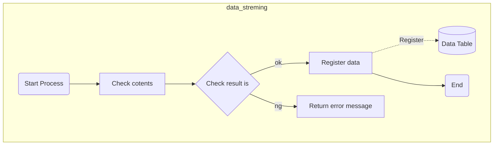

```mermaid
flowchart TD

subgraph data_streming
A(Start Process)-->B[Check cotents]
B[Check cotents]-->C{Check result is}
C-->|ok|D[Register data]
C-->|ng|E[Return error message]
D-.->|Register|F[(Data Table)]
D-->G(End)
end
```